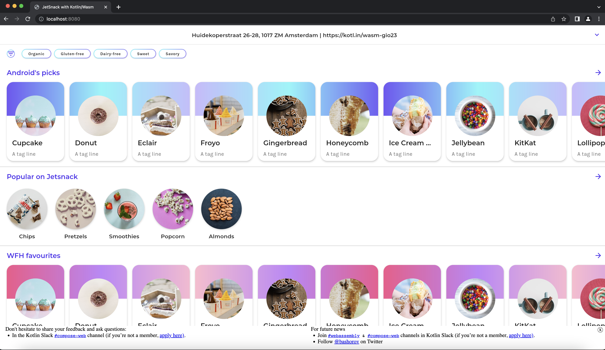

# Jetsnack

Web version of [Jetsnack application](https://github.com/android/compose-samples/tree/main/Jetsnack) built with [Compose Multiplatform for Web](#compose-multiplatform-for-web) and [Kotlin/Wasm](#kotlinwasm).

## Kotlin/Wasm

Kotlin/Wasm is a new experimental target that enables developers to compile Kotlin code to WebAssembly (Wasm).

By compiling Kotlin code to WebAssembly, you can run it on any WebAssembly-compatible environment that meets Kotlin's requirements, including web browsers.
This creates numerous opportunities, such as developing high-performance web applications and serverless functions.

## Compose Multiplatform for Web

Compose for Web is based on [Kotlin/Wasm](https://kotl.in/wasm), the newest target for Kotlin Multiplatform projects.
It allows you to run your code in the browser with all the benefits that WebAssembly has to offer, such as good and predictable performance for your applications.

## Setup environment

### IDE

We recommend using [IntelliJ IDEA 2023.1 or later](https://www.jetbrains.com/idea/) to work with the project.
It has Kotlin/Wasm support out of the box.

### Browser (for Kotlin/Wasm target)

To run applications built with Kotlin/Wasm in a browser, you need a browser supporting [wasm garbage collection feature](https://github.com/WebAssembly/gc):

- For **Chrome** and **Chromium-based** browsers (Edge, Brave etc.), it **should just work** since version 119.
- For **Firefox** 120 it **should just work**.
- For **Firefox** 119:
    1. Open `about:config` in the browser.
    2. Enable **javascript.options.wasm_gc**.
    3. Refresh the page.

For more information see https://kotl.in/wasm_help/.

## Build and run

Check out the repository, navigate to the project folder, and use the following commands:

###un Web version via Gradle R

Run the following Gradle command in the terminal: `./gradlew :web:wasmJsRun`

Once the application starts, open the following URL in your browser: `http://localhost:8080`

### Run Desktop version via Gradle

Run the following Gradle command in the terminal: `./gradlew :desktop:run`

### Install Android application via Gradle

Run the following Gradle command in the terminal: `./gradlew :android:installDebug`
